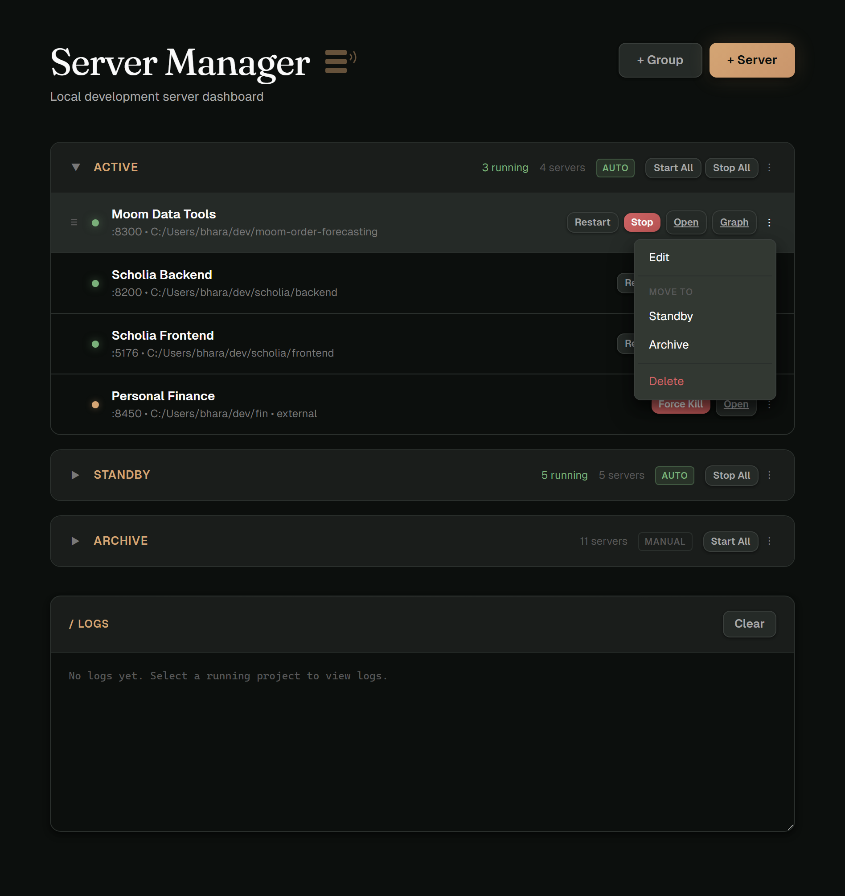
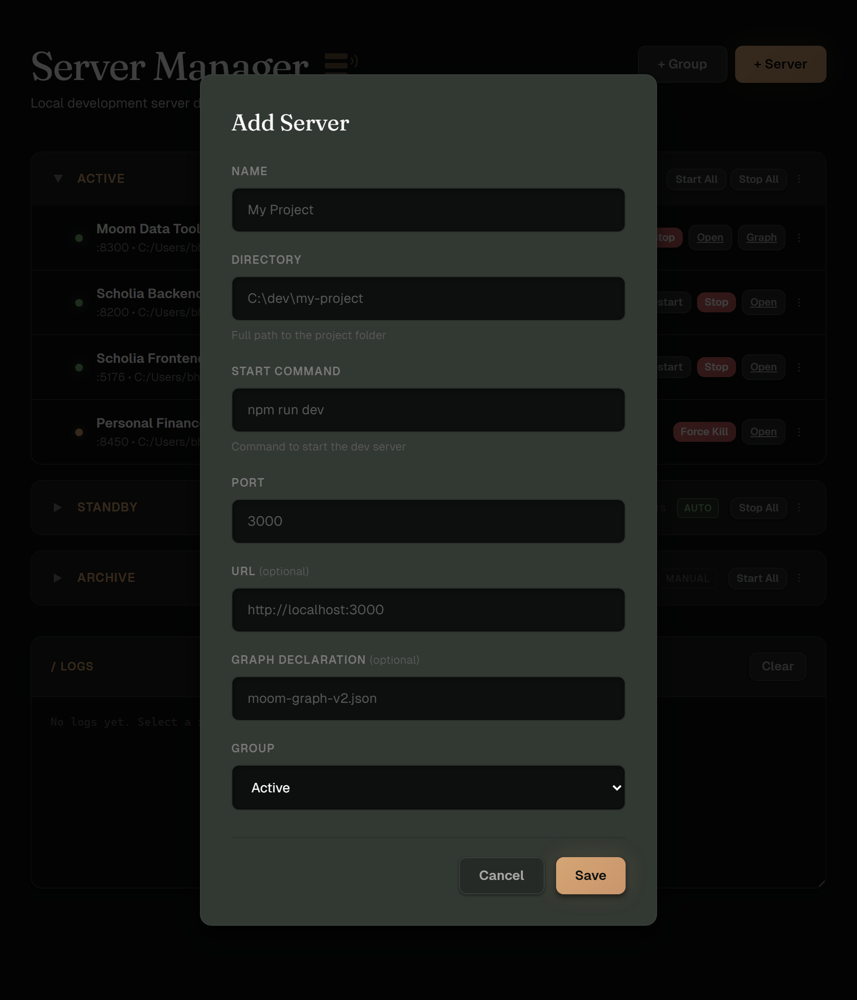

# Dev Server Manager

A lightweight local dashboard for managing multiple development servers. Organize servers into groups, start and stop them with one click, stream logs in real time, and auto-launch on Windows boot. Never lose track of a port again.

Built for developers juggling multiple services (frontend + backend, microservices, side projects) who want a visual overview without the overhead of Docker Compose or PM2.

  



## Features

- **Server groups** — Organize projects into collapsible groups (Active, Standby, Archive, or your own)
- **Drag-and-drop** — Reorder servers within groups or move them between groups
- **Auto-start on boot** — Groups marked AUTO launch their servers sequentially on Windows startup
- **Batch operations** — Start All / Stop All per group
- **Three-state status detection** — Running (we started it), External (port occupied by something else), Stopped
- **One-click start/stop/restart** — Launch and terminate processes from the browser
- **Log streaming** — Live-tailing last 100 lines per project, updated every 2 seconds
- **Process persistence** — Managed processes survive manager restarts; the dashboard reconnects to them
- **Force kill** — Kill external processes holding a port you need, with multi-method fallback
- **Virtual environment support** — Relative paths like `venv/Scripts/python` are resolved automatically
- **fnm integration** — Detects Fast Node Manager installations so `npm` commands work out of the box
- **Zero dependencies frontend** — Single HTML file with embedded CSS/JS, no build step

## Quick Start

### Prerequisites

- Python 3.10+
- Windows (process management uses Windows-specific APIs)
- [fnm](https://github.com/Schniz/fnm) (optional, for Node.js/npm projects)

### Installation

```bash
git clone https://github.com/bharat2288/devserver-manager.git
cd devserver-manager
pip install -r requirements.txt
```

### Running

```bash
python main.py
```

Then open [http://localhost:9000](http://localhost:9000) in your browser.

### Auto-Start on Boot

Place the included `start-silent.vbs` in your Windows Startup folder to launch the manager silently on login:

```powershell
# Copy to Startup folder
Copy-Item start-silent.vbs "$env:APPDATA\Microsoft\Windows\Start Menu\Programs\Startup\"
```

Groups marked **AUTO** will start their servers sequentially (2-second delay between each) when the manager launches.

### Adding Projects

1. Click **+ Server** in the dashboard
2. Fill in the project name, directory path, start command, port, and group
3. Click Save
4. Hit **Start** to launch the server



Or copy `config/projects.example.json` to `config/projects.json` and edit manually.

## Architecture

```
Browser (localhost:9000)
    │
    ▼  REST API (polling every 3s)
┌─────────────────────────────────────────────┐
│          FastAPI Backend (main.py)           │
│                                             │
│  Groups CRUD  ·  Projects CRUD  ·  Process  │
│  (JSON storage)  (JSON storage)   Manager   │
└─────────────────────────────────────────────┘
    │                    │                │
    ▼                    ▼                ▼
projects.json    File-based logs    psutil/socket
```

- **Backend**: FastAPI serving a REST API + the dashboard HTML
- **Frontend**: Single-file SPA with vanilla JS, dark-mode UI, no framework
- **Process management**: `subprocess.Popen` with Windows creation flags for clean process groups
- **Status detection**: Combines tracked PID lookup with port scanning for three-state awareness

### API Endpoints

| Method | Endpoint | Description |
|--------|----------|-------------|
| `GET` | `/api/groups` | List all groups |
| `POST` | `/api/groups` | Create a new group |
| `PUT` | `/api/groups/{id}` | Update group (name, auto_start, collapsed) |
| `DELETE` | `/api/groups/{id}` | Delete group (moves projects to fallback) |
| `POST` | `/api/groups/{id}/start-all` | Start all stopped servers in group |
| `POST` | `/api/groups/{id}/stop-all` | Stop all running servers in group |
| `GET` | `/api/projects` | List all projects with status |
| `POST` | `/api/projects` | Add a new project |
| `PUT` | `/api/projects/{id}` | Update project config |
| `DELETE` | `/api/projects/{id}` | Remove project (stops if running) |
| `PUT` | `/api/projects/{id}/move` | Move project to group + position |
| `POST` | `/api/projects/{id}/start` | Start server process |
| `POST` | `/api/projects/{id}/stop` | Stop server process |
| `POST` | `/api/projects/{id}/restart` | Restart server process |
| `GET` | `/api/projects/{id}/logs` | Get recent log lines |
| `POST` | `/api/ports/{port}/kill` | Kill whatever is using a port |
| `GET` | `/api/ports/{port}/info` | Get process info for a port |

## Configuration

Projects and groups are stored in `config/projects.json` (created automatically on first use). See `config/projects.example.json` for the format:

```json
{
  "groups": [
    {
      "id": "active",
      "name": "Active",
      "auto_start": true,
      "collapsed": false,
      "position": 0
    }
  ],
  "projects": [
    {
      "id": "my-api",
      "name": "My API Server",
      "directory": "C:/dev/my-project/backend",
      "start_command": "python -m uvicorn main:app --reload --port 8000",
      "port": 8000,
      "url": "http://localhost:8000",
      "group": "active",
      "position": 0
    }
  ]
}
```

The `url` field is optional — when present, it adds an "Open" button to the dashboard.

## Limitations

- **Windows only** — Process management uses Windows-specific subprocess flags (`CREATE_NEW_PROCESS_GROUP`, `CREATE_NO_WINDOW`), netstat parsing, and PowerShell fallbacks. Linux/macOS support would require a platform abstraction layer.
- **Local only** — Binds to `127.0.0.1:9000` with no authentication. Not designed for remote access.
- **No process adoption** — Can't attach to processes started outside the manager (but detects them as "external").
- **No health checks** — Status is based on port availability, not HTTP response verification.

## Security

This tool runs locally and is designed for single-user development workflows:

- Binds only to `localhost` (not `0.0.0.0`)
- No authentication (local trust model)
- Start commands are stored in config and executed via `shell=True` — only the machine owner should edit the config
- No sensitive data is transmitted or stored

## License

MIT
